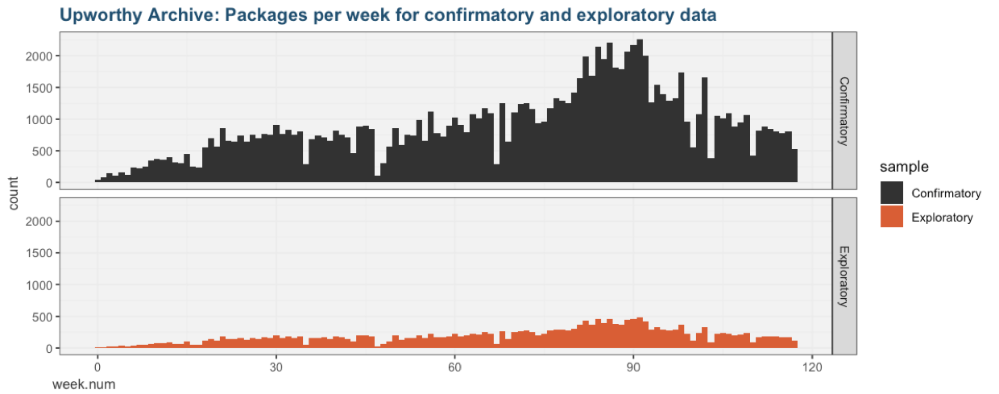

# Data in the Upworthy Research Archive

[The Upworthy Research Archive](index) is a dataset of headline A/B tests conducted by Upworthy from early 2013 into April 2015. This page documents the archive.

## Background
For background on the Upworthy Archive, please consult and cite the following sources:
* Matias, J.N., Munger, K. (2019) [The Upworthy Research Archive: A Time Series of 32,488 Experiments in U.S. Advocacy](https://osf.io/246yq/). CODE@ MIT Conference.
   * Medium post: [Announcing the Upworthy Research Archive](https://medium.com/@natematias/announcing-the-upworthy-research-archive-c9b11087ddeb)
* Matias, J.N. Aubin Le Quere, M. (2020) **[Asking Questions of the Upworthy Research Archive](resources/lecture-15-asking-questions-of-the-upworthy-archive.pdf)**, a slide deck from Matias's field experiments class. This deck includes advice on meta-analyzing the archive.

## Units of Observation

The Upworthy Research Archive contains `packages` within `tests`. On Upworthy, packages are bundles of headlines and images that were randomly assigned to people on the website as part of a test. Tests can include many packages.

The archive only includes aggregate results on the number of viewers a package received and how many of those viewers clicked on that package. It does not include any individual-level information to differentiate between viewers.

## Inclusion/Exclusion Criteria
This research archive includes valid tests conducted by Upworthy in the study period. We have omitted tests that were never shown to viewers (zero impressions) and packages that had missing test IDs.

## Exploratory and Confirmatory Datasets
To support reliable scholarly research and education, we are releasing the Upworthy Research Archive as a partial **exploratory dataset**. We will share a **confirmatory dataset** with researchers whose analysis plans have been peer reviewed ([read more about the process](index)).

The exploratory dataset includes 22,666 packages from 4,873 tests. The confirmatory dataset includes 105,551 additional packages from 22,743 tests. 

To support time-series research, both datasets are a random sample stratified by week number.

## Columns in the Upworthy Research Archive
The dataset of `packages` contains the following columns:

Time-related columns:
* **created_at**: time the package was created (timezone unknown)
* **test_week**: week the package was created, a variable constructed by the archive creators for stratified random sampling

Experiment-related columns:
* **clickability_test_id**: the test ID. Viewers were randomly assigned to packages with the same test ID
* **impressions**: the number of viewers who were assigned to this package. The total number of participants for a given test is the sum of `impressions` for all packages that share the same `clickability_test_id`. 

Stimuli shown to viewers:
* **headline**: the headline being tested
* **eyecatcher_id**: image ID. Image files are not available. Packages that shared the same image have the same eyecatcher_id

Outcomes:
* **clicks**: the number of viewers (impressions) that clicked on the package. The click-rate for a given package is the number of `clicks` divided by the number of `impressions`.

Miscellaneous columns that may be of interest. To our knowledge, none of these columns represent information shown to viewers as part of A/B tests:
* **excerpt**: article excerpt
* **lede**: the opening sentence or paragraph of the story
* **slug**: internal name for the web address
* **share_text**: summary for display on social media when the article is shared. This was not shown in tests, since tests were conducted on the Upworthy website

Columns we are still researching, in conversation with former staff:

* **square**
* **significance**
* **first_place**
* **winner**
* **updated_at**

We have also been scraping Upworthy and the Internet Archive in search of supplementary information, including images. Since only some tests and packages can be supplemented in this way, we are doubtful that this data will be useful for confirmatory research. Please contact us if you think that these columns might be important to your research.
