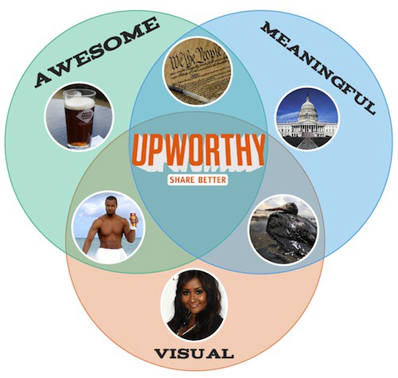

# The Upworthy Research Archive

* [J. Nathan Matias](https://natematias.com), *Assistant Professor, Cornell University: co-lead* (ongoing contact)
* [Kevin Munger](http://www.kevinmunger.com/), *Assistant Professor, Penn State University: co-lead* (ongoing contact)
* [Marianne Aubin Le Quere](https://mariannealq.com/), *PhD student, Cornell University: data validation and documentation*
* [Charles Ebersole](http://charlesrebersole.weebly.com/), *Postdoc, University of Virginia: data controller*

**The Upworthy Research Archive is an open dataset of thousands of A/B tests of headlines conducted by Upworthy from January 2013 to April 2015.** At the time of release, it is the largest open-access collection of randomized behavioral studies openly available for research and education. We hope it doesn't stay that way for long (see below if you wish to contribute data).

We have published a data descriptor with Nature Scientific Data that fully describes the dataset and includes validation information:

* Matias, J., Munger, K., Aubin Le Quere, M., Ebersole, C. (2021) **[The Upworthy Research Archive, a time series of 32,487 experiments in U.S. media](https://doi.org/10.1038/s41597-021-00934-7).** Nature Scientific Data.

## News and Updates
* Critical update June 2024: **[Ensuring Reliable Science from Platform A/B Test Archives - an Update to the Upworthy Archive](2024-06-upworthy-archive-update.html)**
* Original project announcement: **[Announcing the Upworthy Research Archive: Help us advance human understanding by studying this massive dataset of headline A/B tests](https://natematias.medium.com/announcing-the-upworthy-research-archive-c9b11087ddeb)**

## What can I do with the Upworthy Research Archive?

We hope this dataset will be used in three ways: to conduct academic research, to serve as an resource for educators, and to inform the implementation of A/B tests by organizations.

We expect that this dataset will help advance knowledge in many fields, including:

* **Political Science, Communication, Psychology, and Marketing** theories on the language that influences people to click on articles
* **Organizational Behavior** research on how firms learn over time (or not) through experimentation
* **Statistical** advances on the analysis of experiments
* **Computer Science** research in machine learning and cybersecurity
* **Meta-scientific questions** about the knowledge from behavioral experiments and how useful they are at predicting future outcomes

## How can I learn more about Upworthy?
We suggest the following references:
* Karpf, D. (2016). **[Analytic activism: Digital listening and the new political strategy](https://global.oup.com/academic/product/analytic-activism-9780190266134?cc=us&lang=en&)**. Oxford University Press.
  * David Karpf's book puts Upworthy in its context in U.S. politics and contemporary context. It includes a chapter based on interviews with staff at Upworthy.
* Fitts, Alexis Sobel. (2014) **[The king of content: How Upworthy aims to alter the Web, and could end up altering the world](https://archives.cjr.org/feature/the_king_of_content.php)**. Columbia Journalism Review.
    * This article, published partway through the dataset, includes details about how Upworthy founders and staff thought about and talked about their work in public.
* Matias, J.N., Munger, K. (2019) **[The Upworthy Research Archive: A Time Series of 32,488 Experiments in U.S. Advocacy](https://osf.io/246yq/).** CODE@ MIT Conference 

## What is the structure of the data? 

**[About the Archive](about-the-archive)** contains a full description of the data, references and slides.

## Confirmatory Research with the Upworthy Research Archive

Multiple comparisons and overfitting represent serious risks to scientific understanding with a dataset of this size. By doing the extra work of supporting cross-validation, we hope to maximize the amount of highly-credible science that results from this this dataset. For that reason, we have structured the data to support researchers to develop registered reports for research projects.

We are providing an **Exploratory Dataset** of 4,873 experiments to support academic research and teaching. For researchers who plan to conduct confirmatory research that tests hypotheses, we are keeping a larger **Confirmatory Dataset** of 22,743 experiments in reserve. During the period until we released the dataset publicly in August 2021, we also retained a holdout dataset for a meta-scientific study with the Center for Open Science.

The full dataset, with all parts, may now be accessed on the Open Science Framework at [https://osf.io/jd64p/]( https://osf.io/jd64p/)

## Impact
The following projects are just some of the scholarly projects that cite or draw on the Upworthy Archive in some way:

### Scientific Studies Using the Archive
* Robertson, C. E., Pröllochs, N., Schwarzenegger, K., Pärnamets, P., Van Bavel, J. J., & Feuerriegel, S. (2023). [Negativity drives online news consumption](https://www.nature.com/articles/s41562-023-01538-4). Nature Human Behaviour, 7(5), 812-822.
  * Robertson, Claire (2023) [Two research teams submitted the same paper to Nature - You won't BELIEVE what happens next!!](https://communities.springernature.com/posts/two-research-teams-submitted-the-same-paper-to-nature-you-won-t-believe-what-happens-next). Springer Nature Research Communities.
  * Benton, J. (2023) [Negative words in news headlines generate more clicks — but sad words are more effective than angry or scary ones](https://www.niemanlab.org/2023/03/negative-words-in-news-headlines-generate-more-clicks-but-sad-words-are-more-effective-than-angry-or-scary-ones/). Nieman Lab.
* Larsen, N., Stallrich, J., Sengupta, S., Deng, A., Kohavi, R., & Stevens, N. T. (2024). [Statistical challenges in online controlled experiments: A review of a/b testing methodology](https://www.tandfonline.com/doi/full/10.1080/00031305.2023.2257237). The American Statistician, 78(2), 135-149.
* Shulman, H. C., Markowitz, D. M., & Rogers, T. (2024). [Reading dies in complexity: Online news consumers prefer simple writing](https://www.science.org/doi/full/10.1126/sciadv.adn2555). Science Advances, 10(23), eadn2555.
* Gligorić, K., Lifchits, G., West, R., & Anderson, A. (2023). [Linguistic effects on news headline success: Evidence from thousands of online field experiments](https://journals.plos.org/plosone/article?id=10.1371/journal.pone.0281682) (Registered Report). Plos one, 18(3), e0281682.

### Textbooks
* Alexander, R. (2023). [Telling Stories with Data: With Applications in R](https://www.taylorfrancis.com/books/mono/10.1201/9781003229407/telling-stories-data-rohan-alexander). Chapman and Hall/CRC.

### Guidance on Science Overall
* Robertson, C. E., Pröllochs, N., Schwarzenegger, K., Pärnamets, P., Van Bavel, J. J., & Feuerriegel, S. (2023). [Negativity drives online news consumption](https://www.nature.com/articles/s41562-023-01538-4). Nature Human Behaviour, 7(5), 812-822.
* Polonioli, A., Ghioni, R., Greco, C., Juneja, P., Tagliabue, J., Watson, D., & Floridi, L. (2023). [The Ethics of Online Controlled Experiments (A/B Testing)](https://link.springer.com/article/10.1007/s11023-023-09644-y). Minds and Machines, 1-27.

### Statistical Advances
* Wu, J. J., Mazzuchi, T. A., & Sarkani, S. (2023). [Comparison of multi-criteria decision-making methods for online controlled experiments in a launch decision-making framework](https://www.sciencedirect.com/science/article/pii/S0950584922002245?casa_token=ze3TjmIH1gsAAAAA:EUrtXfKFp654J7rdc7R2AeabtyYUPd1WumZVJYGyfZzTfhShoIGq2td40zEvhdaDp6bBPrrLq4U). Information and Software Technology, 155, 107115.

### Other Data Releases
* Crabtree, C., Kim, J. Y., Gaddis, S. M., Holbein, J. B., Guage, C., & Marx, W. W. (2023). [Validated names for experimental studies on race and ethnicity](https://www.nature.com/articles/s41597-023-01947-0). Scientific data, 10(1), 130.

## What is a Registered Report?

To learn more, see [the Center for Open Science introduction to registered reports](https://cos.io/rr/).

Generally, Registered Reports are form of "results-blind" peer review. A journal will evaluate the submission in terms of the appropriateness of the analysis strategy for addressing the theoretical question.

With the Upworthy Research Archive, researchers can use the Exploratory Dataset to understand the structure of the data and write code to analyze it. Journals will then review the scientific merit of the Registered Report, and if they agree to publish it, the code can be run on the Confirmatory dataset to produce the final results.

To date, 242 academic journals have published Registered Reports. The full list can be found [here,](https://cos.io/rr/) under the "Participating Journals" tab.

## I operate a publisher and want to add to the archive by donating our historical A/B tests
We live in a time of unprecedented behavioral research by news publishers, advertisers, and tech companies. By donating your historical A/B tests, you can contribute to education and to breakthroughs across multiple scientific fields. 

Our team can help you assess the potential scientific value of your archives and chart a privacy-preserving way to contribute to open knowledge. Please contact J. Nathan Matias &lt;<nathan.matias@cornell.edu>&gt; if this interests you.

## How can I use the archive with my students?
J. Nathan Matias has developed a first draft of open educational resources for undergraduate classes. Please contact Nathan if you are interested to use the archive for your class.

## Advisory Board
* Dr. [Helen Margetts](https://www.oii.ox.ac.uk/people/helen-margetts/) is is Professor of Society and the Internet and Professorial Fellow at Mansfield College, Oxford.
* Dr. [David Karpf](https://smpa.gwu.edu/david-karpf) is an associate professor in the School of Media and Public Affairs at George Washington University
* Dr. [Brian Nosek](https://www.projectimplicit.net/nosek/) is a professor in the Department of Psychology at the University of Virginia.

## Acknowledgments
Kevin, Nathan, and Marianne are grateful to the following people and organizations for providing key support and input in the creation of the Upworthy Research Archive.
* Good/Upworthy
* Andy Morris
* Andrew Singh
* Rajni Aneja
* Matt Salganik
* Jason Rhody

## Disclaimer
While we are very grateful to Good/Upworthy for donating this data for scientific and educational purposes, this project is independent from the company. This website does not speak for Good/Upworthy in any way.
